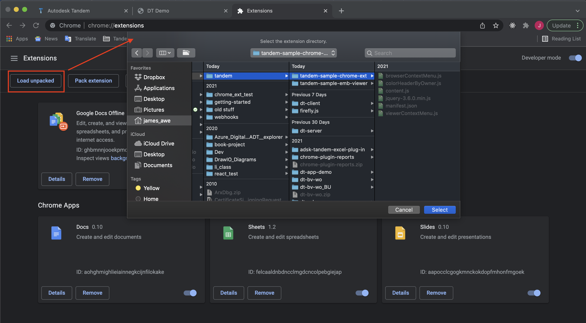
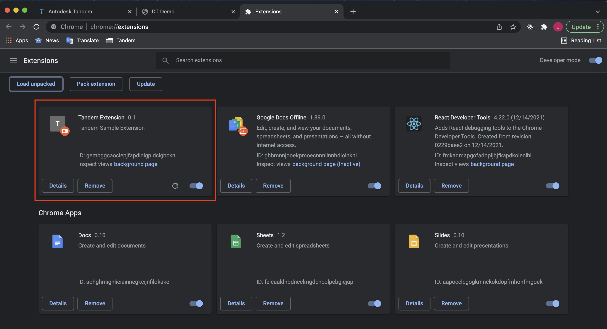
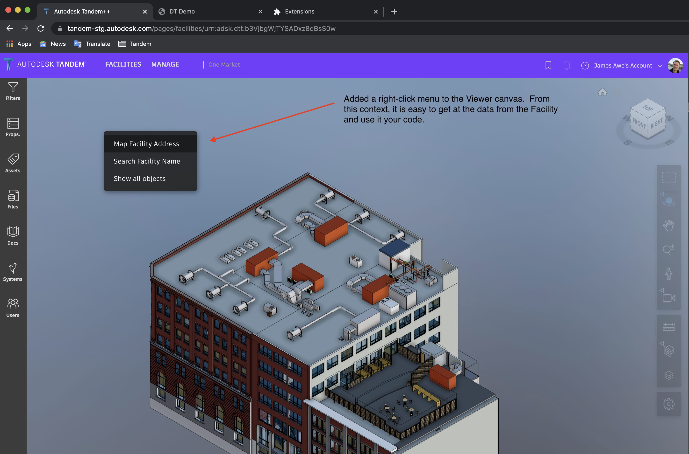
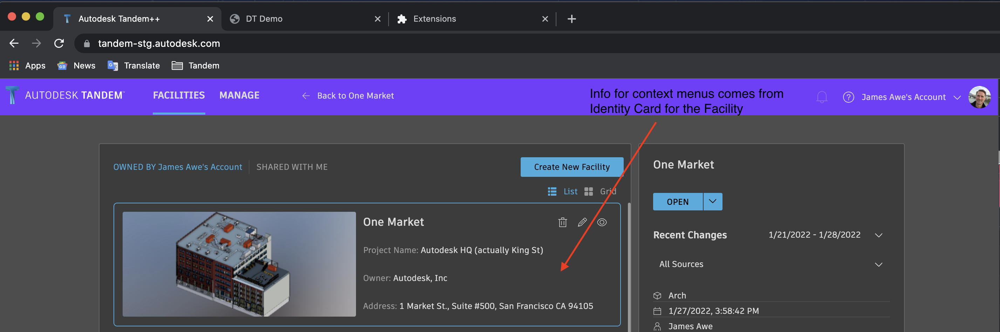

## Tandem Chrome Extension

A very simple test to see what is possible with a Chrome Extension.  So far, we are just exploring how to get access to the Tandem data model from various browser contexts.  An extension gets boxed in and has to do some tricky communication between contexts.  This is not an exhaustive sample yet, but does show it is possible to add a right-click menu to the Viewer that has full access to the Tandem Facility data.  It also does some minimal re-styling of the HTML.

NOTE: browser extensions are NOT officially supported.  Anything you do here is at your own risk.

## Steps

1. Use the Chrome browser
2. Load the extension
3. Refresh the Tandem page

